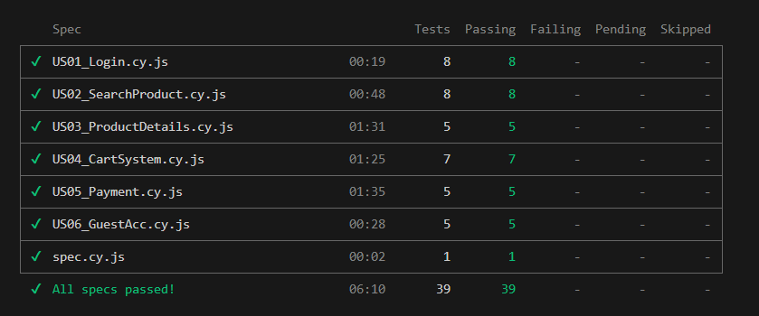
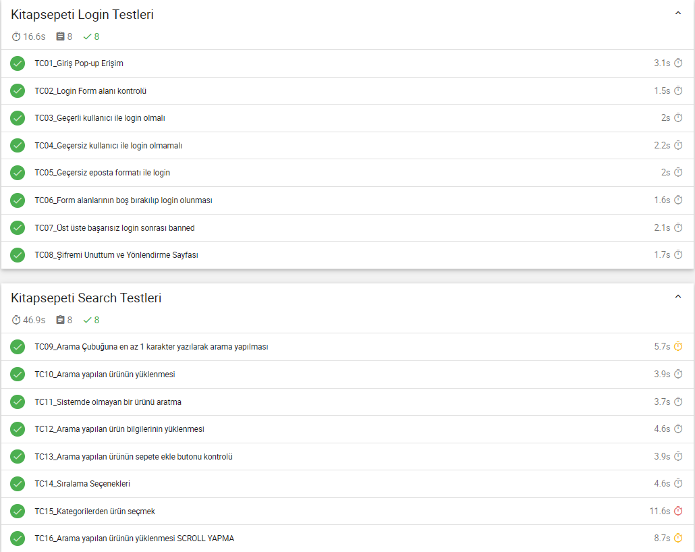
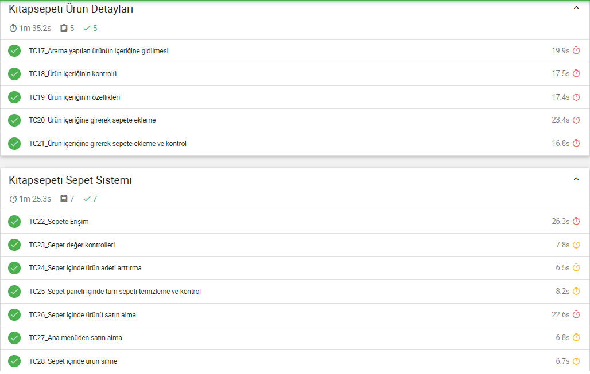
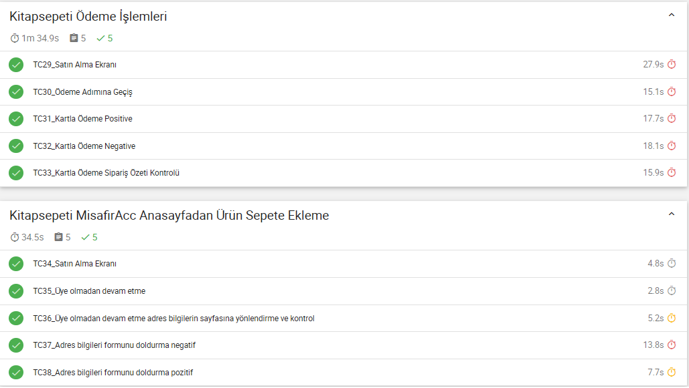

**🔵 Cypress E2E Test Projesi**

Bu proje, bir e-ticaret sitesinin temel kullanıcı senaryolarını **Cypress ile otomatik olarak test etmek** amacıyla hazırlanmıştır.  
Login, ürün arama, ürün detayına giriş, sepete ekleme ve ödeme işlemleri gibi test senaryolarını kapsamaktadır.

---

**📝 Proje Özeti**

- Login testi (pozitif/negatif case)  
- Ürün arama ve filtreleme  
- Ürün detayına giriş  
- Sepete yönetimi ve kontrolü  
- Ödeme ve Sipariş Onayı  
- Misafir olarak satın alma işlemleri  
- Testler POM (Page Object Model) yapısına uygun olarak yazılmıştır
- Kullanılan araçlar ve Teknolojiler ;
- **VS Code** — Kod editörü  
- **Cypress** — E2E Test Framework  
- **Mocha/Mochawesome** — Test raporlama  
- **Node.js / npm** — Paket ve script yönetimi


---

**📂 Dosya Yapısı**

```
KITAP_SEPETI
├─ /cypress
│  ├─ /e2e            -> Test senaryoları
│  ├─ /fixtures       -> Test verileri
│  └─ /support        -> Custom commands ve setup
├─ /cypress/screenshots/ -> Test screenshotları
├─ /cypress/videos/      -> Test videoları
├─ /cypress/reports/html -> HTML raporlar (Mochawesome)
├─ /node_modules         -> Node paketleri
├─ cypress.config.js     -> Cypress yapılandırma dosyası
├─ package.json          -> Proje bağımlılıkları
└─ README.md             -> Proje açıklaması
```

---


**📂 Kurulum ve Çalıştırma**

```bash
# Projeyi klonla
git clone https://github.com/kullanici/KITAP_SEPETI.git

# Proje klasörüne gir
cd KITAP_SEPETI

# Gerekli tüm kütüphaneleri yükle
npm install

# Cypress GUI ile testleri çalıştır
npx cypress open

# CLI ile tüm testleri çalıştır
npx cypress run

# JSON dosyalarını birleştir
npx mochawesome-merge cypress/reports/mochawesome_*.json > cypress/reports/merged.json

# HTML raporunu oluştur
npx marge cypress/reports/merged.json --reportDir cypress/reports --inline

# HTML raporu aç (Windows)
start cypress/reports/html/report.html

# HTML raporu aç (Mac)
open cypress/reports/html/report.html

# HTML raporu aç (Linux)
xdg-open cypress/reports/html/report.html


---


**🔵 Config ayarları ve Mocha kurulumu için gerekli şartlar**


const { defineConfig } = require("cypress");

module.exports = defineConfig({
  // Reporter Ayarları
  reporter: "mochawesome",
  reporterOptions: {
    reportDir: "cypress/reports", // HTML raporların kaydedileceği klasör
    overwrite: true,               // Önceki raporların üzerine yaz
    html: true,                    // HTML rapor oluştur (tek tek çalıştırma gerekir)
    json: false                     // JSON raporu istemiyorsan false
  },

  // E2E Test Ayarları
  e2e: {
    screenshotsFolder: "cypress/screenshots", // Hatalı testlerde screenshot klasörü
    videosFolder: "cypress/videos",           // Test videolarının kaydedileceği klasör
    video: true,                               // Video kaydını aktif et
    screenshotOnRunFailure: true,              // Test başarısız olursa otomatik screenshot al
    supportFile: "cypress/support/e2e.js",    // Support dosyası
  },
}); 
```

---

**📸Cypress Run Report Screenshot**
 









---


**📚 Proje Dokümantasyonları**

📄 [Test Cases](https://docs.google.com/spreadsheets/d/1pnHqBMybE7YNjfT18sOoe9O6OF0vTT-qjGVgqAJzSgY/edit?usp=sharing) — User Story kabul kriterleri temel alınarak hazırlanmış test senaryoları.

📄 [Test Acceptance Criterias](https://docs.google.com/spreadsheets/d/1yI188XeFEMgtu2LrL9QDRiNO8rF1pnPFFAomGV-uI-0/edit?gid=1345439340#gid=1345439340) — Test kabul kriterlerini içeren doküman.


